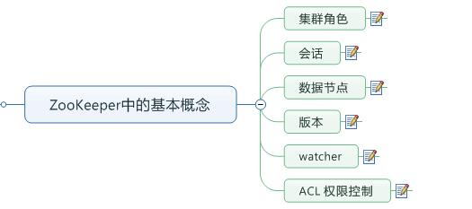
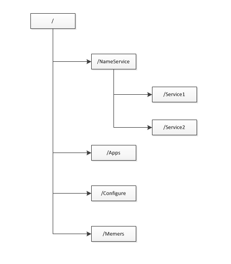
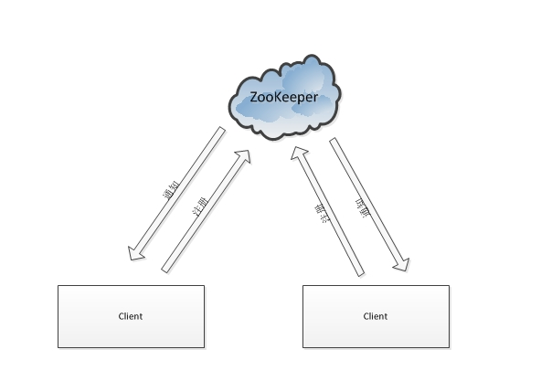

### ZooKeeper基本概念  
  
#### (一)集群角色(Leader，Follower，Observer)  
1. Leader服务器是整个Zookeeper集群工作机制中的核心  
2. Follower服务器是Zookeeper集群状态的跟随者  
Leader，Follower 设计模式
3. Observer服务器充当一个观察者的角色  
Observer 观察者设计模式  

#### (二)会话  
 会话是指客户端和ZooKeeper服务器的连接，ZooKeeper中的会话叫Session，客户端靠与服务器建立一个TCP的长连接来维持一个Session,客户端在启动的时候首先会与服务器建立一个TCP连接，通过这个连接，客户端能够通过心跳检测与服务器保持有效的会话，也能向ZK服务器发送请求并获得响应  

#### (三)数据节点  
Zookeeper中的节点有两类  
1. 集群中的一台机器称为一个节点  
2. 数据模型中的数据单元Znode，分为持久节点和临时节点  
Zookeeper的数据模型是一棵树,树的节点就是Znode，Znode中可以保存信息  
如下图所示：  
  

#### (四)版本  
如图：  
 |版本类型|说明|  
 |------------|-----------|  
 | version	| 当前数据节点数据内容的版本号 |  
 | cversion	| 当前数据节点子节点的版本号 |  
 | aversion	| 当前数据节点ACL变更版本号 |  
 
悲观锁和乐观锁  
 > 悲观锁又叫悲观并发锁，是数据库中一种非常严格的锁策略，具有强烈的排他性，能够避免不同事务对同一数据并发更新造成的数据不一致性，在上一个事务没有完成之前，下一个事务不能访问相同的资源，适合数据更新竞争非常激烈的场景  
 > 相比悲观锁，乐观锁使用的场景会更多，悲观锁认为事务访问相同数据的时候一定会出现相互的干扰，所以简单粗暴的使用排他访问的方式，而乐观锁认为不同事务访问相同资源是很少出现相互干扰的情况，因此在事务处理期间不需要进行并发控制，当然乐观锁也是锁，它还是会有并发的控制！对于数据库我们通常的做法是在每个表中增加一个version版本字段，事务修改数据之前先读出数据，当然版号也顺势读取出来，然后把这个读取出来的版本号加入到更新语句的条件中，比如，读取出来的版本号是1,我们修改数据的语句可以这样写，update 某某表 set 字段一=某某值 where id=1 and version=1，那如果更新失败了说明以后其他事务已经修改过数据了，那系统需要抛出异常给客户端，让客户端自行处理，客户端可以选择重试  
 
#### (五)watcher事件监听器  
ZooKeeper允许用户在指定节点上注册一些Watcher，当数据节点发生变化的时候，  
ZooKeeper服务器会把这个变化的通知发送给感兴趣的客户端  
  

#### (六)ACL 权限控制  
ACL是Access Control Lists 的简写， ZooKeeper采用ACL策略来进行权限控制，有以下权限：  
1. CREATE:创建子节点的权限  
2. READ:获取节点数据和子节点列表的权限  
3. :更新节点数据的权限  
4. DELETE:删除子节点的权限  
5. ADMIN:设置节点ACL的权限  

 
