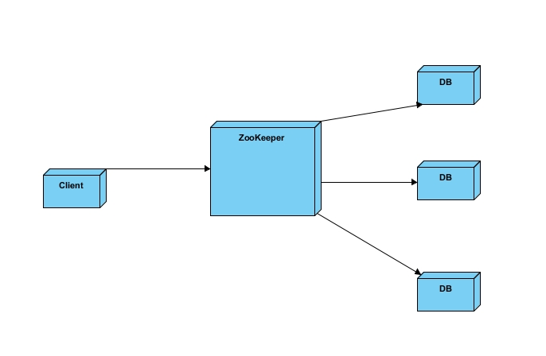

### zookeeper概述  
#### （一）zookeeper背景  
1. 随着互联网技术的高速发展，企业对计算机系统的计算、存储能力要求越来越高，最简单的证明就是出现了一些诸如：高并发，海量存储这样的词汇。在这样的背景下，单纯依靠少量高性能主机来完成计算任务已经不能满足企业的需求，企业的IT架构逐步从集中式向分布式过渡，所谓的分布式是指：把一个计算任务分解成若干个计算单元，并且分派到若干不同的计算机中去执行，然后汇总计算结果的过程！  

#### （二）zookeeper是什么？  
1. zookeeper是什么：ZooKeeper是源代码开放的分布式协调服务，由雅虎创建，是Google Chubby的开源实现。ZooKeeper是一个高性能的分布式数据一致性解决方案，它将那些复杂的、容易出错的分布式一致性服务封装起来，构成一个高效可靠的原语集，并提供一系列简单易用的接口给用户使用
2. 知识要点：  
a. 源代码开放  
b. 是分布式协调服务，它解决分布式数据一致性问题  
   A：顺序一致性  B：原子性  C：单一视图  
   D：可靠性  E：实时性  
c. 高性能  
d. 我们可以通过调用ZooKeeper提供的接口来解决一些分布式应用中的实际问题  

#### （三）Zookeeper应用场景？  
1. 数据发布/订阅  
> 数据发布/订阅 顾名思义就是一方把数据发布出来，另一方通过某种手段可以得到这些数据  
 通常数据订阅有两种方式：推模式和拉模式，推模式一般是服务器主动向客户端推送信息， 拉模式是客户端主动去服务器获取数据 （通常是采用定时轮询的方式）。  
 ZK采用两种方式相结合:  
  发布者将数据发布到ZK集群节点上，订阅者通过一定的方法告诉服务器，我对哪个节点的数据感兴趣，那服务器在这些节点的数据发生变化时，就通知客户端，客户端得到通知后可以去服务器获取数据信息  
2. 负载均衡  
  
> 步骤：  
a、首先DB在启动的时候先把自己在ZK上注册成一个临时节点，ZK的节点后面我们会讲到有两种，一种是永久节点，一类是临时节点临时节点在服务器出现问题的时候，节点会自动的从ZK上删除，那么这样ZK上的服务器列表就是最新的可用的列表  
b、客户端在需要读写数据库的时候首先它去ZooKeeper得到所有可用的DB的连接信息（一张列表）  
c、客户端随机选择一个与之建立连接  
d、当客户端发现连接不可用的时候可再次从ZK上获取可用的DB连接信息，当然也可以在刚获取的那个列表里移除掉不可用的连接后再随机选择一个DB与之连接  
3. 命名服务  
> 顾名思义，就是提供名称的服务，例如数据库表格ID，一般用得比较多的有两种ID，一种是自动增长的ID，一种是UUID(9291d71a-0354-4d8e-acd8-64f7393c64ae)，两种ID各自都有缺陷，自动增长的ID局限在单库单表中使用，不能在分布式中使用，UUID可以在分布式中使用但是由于ID没有规律难于理解，我们可以借用ZK来生成一个顺序增长的，可以在集群环境下使用的，命名易于理解的ID  
4. 分布式协调/通知  
> 心跳检测  
在分布式系统中，我们常常需要知道某个机器是否可用，传统的开发中，可以通过Ping某个主机来实现，Ping得通说明对方是可用的，相反是不可用的，ZK 中我们让所有的机其都注册一个临时节点，我们判断一个机器是否可用，我们只需要判断这个节点在ZK中是否存在就可以了，不需要直接去连接需要检查的机器 ，降低系统的复杂度  
  
#### （四）zookeeper的优势？  
1. 源代码开放  
2. 已经被证实是高性能，易用稳定的工业级产品  
3. 有着广泛的应用：Hadoop,HBase,Storm,Solr  

