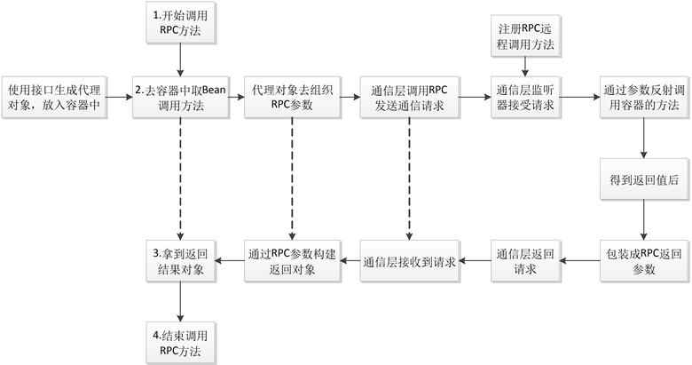
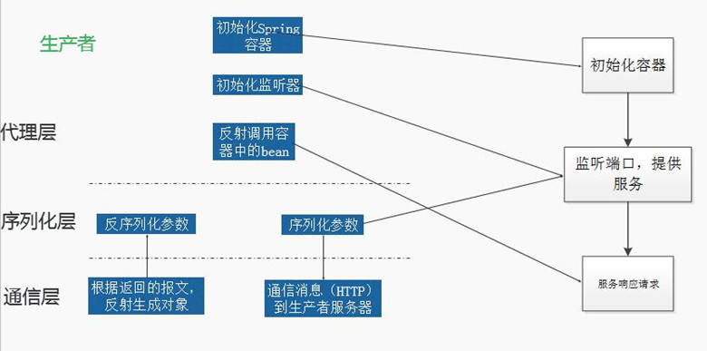
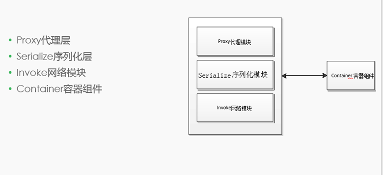

### RPC: java远程过程调用  
 - 远程过程调用（RPC）是一个协议，程序可以使用这个协议请求网络中另一台计算机上某程序的服务而不需知道网络细节  
  
#### RPC设计的目的  
 - 调用非本机的方法  
 - 不同语言程序之间通信  
 - 不了解底层通信，像本地方法一样调用  
  
#### RPC框架的特点  
 - 封装网络交互  
 - 远程调用对象的代理  
 - 支持容器（Spring、Jetty等）  
 - 可配置、可扩展  
  
#### RPC过程详解  
 - RPC框架调用过程详解   
   
  
 - RPC框架调用过程详解-消费者  
   
  
 - RPC框架调用过程详解-生产者   
   
  
  
#### RPC框架设计模型  
 - 四层模型：Proxy代理层、Serialize序列化层、Invoke网络模块、Container容器组件  
 
 
 