### 开源客户端ZkClient  
ZkClient是Github上一个开源的ZooKeeper客户端。ZkClient在ZooKeeper原生
API接口之上进行了包装，是一个更加易用的ZooKeeper客户端。同时，ZkClient在内部实现了诸如Session超时重连、Watcher反复注册等功能。

#### 说明：
* 1.1 com.troylc.testzkclient包主要是[zkclient客户端工具包的代码案例](./src/main/java/com/troylc/testzkclient) 
* 1.2 com.troylc.mastersel包主要是zookeeper的[master选举的代码实现](./src/main/java/com/troylc/mastersel)（[原理解析](#1.2)） 
* 1.3 com.troylc.subscribe包主要是zookeeper的[数据的发布和订阅的代码实现](./src/main/java/com/troylc/subscribe)（[原理解析](#1.3)） 
* 1.4 com.troylc.balance包主要是zookeeper的[负载均衡的代码实现](./src/main/java/com/troylc/balance)（[原理解析](#1.4)） 
* 1.5 com.troylc.lock包主要是zookeeper的[分布式锁的代码实现](./src/main/java/com/troylc/lock)（[原理解析](#1.5)） 
* 1.6 com.troylc.queue包主要是zookeeper的[分布式队列的代码实现](./src/main/java/com/troylc/queue)（[原理解析](#1.6)） 
* 1.7 com.troylc.nameservice包主要是zookeeper的[命令服务的代码实现](./src/main/java/com/troylc/nameservice)（[原理解析](#1.7)） 
<h4 id="1.2">1.2 zookeeper的master选举的原理解析</h4>  
master选举架构图架构图：  
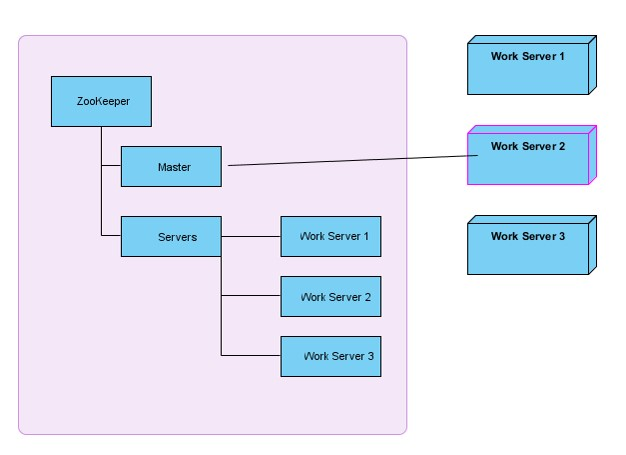  
master选举程序主体流程图  
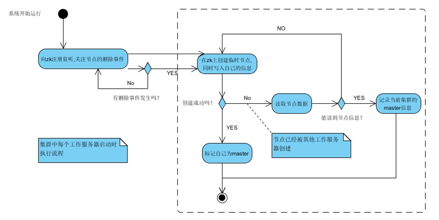  
master选举网络抖动流程图  
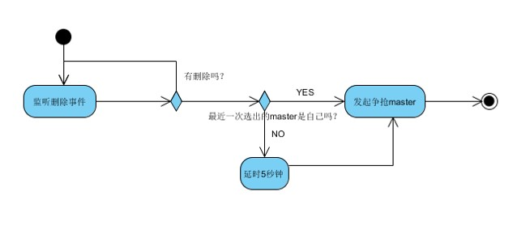  
master选举系统核心类图  
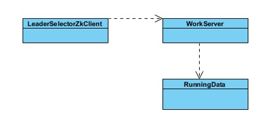  
<h4 id="1.3">1.3. zookeeper的数据的发布和订阅的原理解析</h4>  
数据的发布和订阅架构图:  
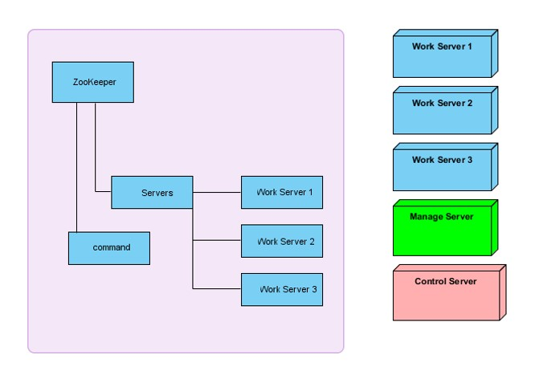  
数据的发布和订阅ManageServer主体流程图:  
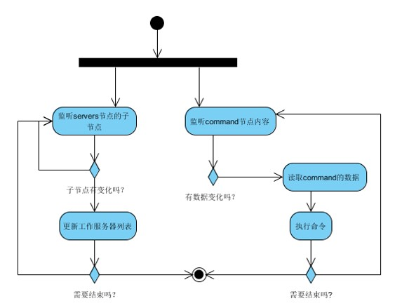  
数据的发布和订阅WorkServer主体流程图:  
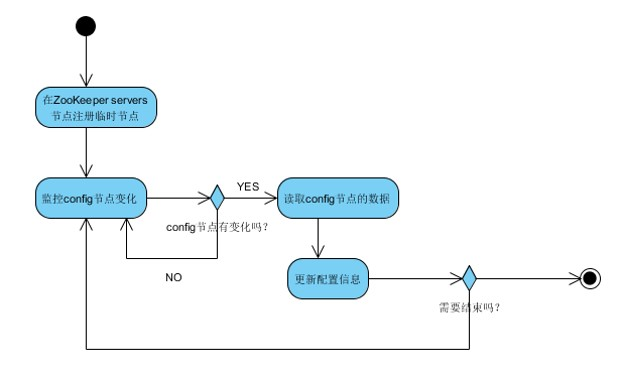  
数据的发布和订阅系统核心类图:  
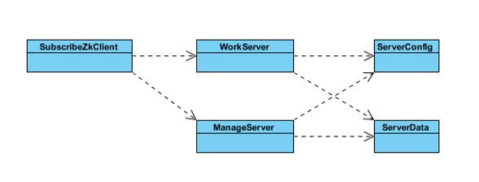  
<h4 id="1.4">1.4. zookeeper的负载均衡原理解析</h4>  
负载均衡架构图  
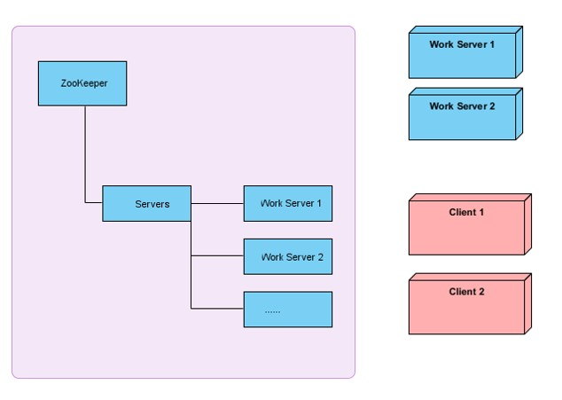  
负载均衡客户端流程图:  
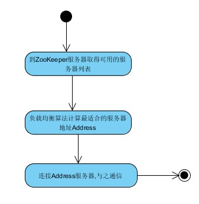  
负载均衡服务端主体流程图:  
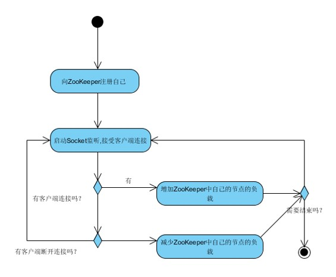  
负载均衡Client端核心类图:  
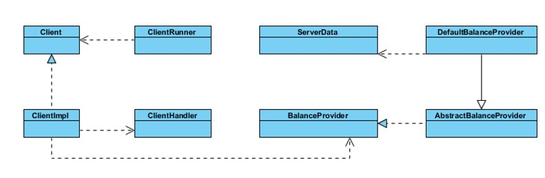  
负载均衡Server端核心类图:  
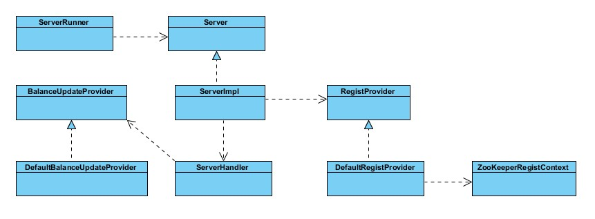  
<h4 id="1.5">1.5. zookeeper的分布式锁原理解析</h4>  
分布式锁架构图  
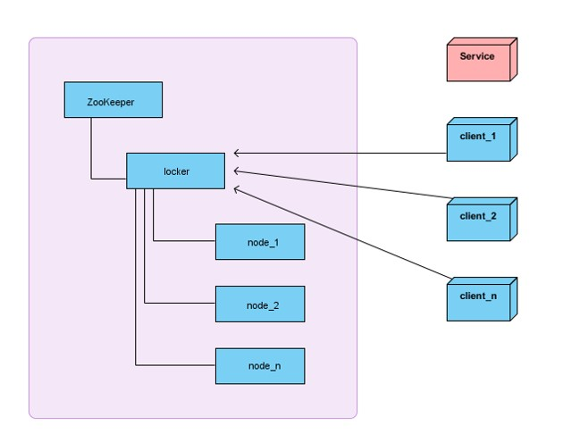  
分布式锁核心算法流程图  
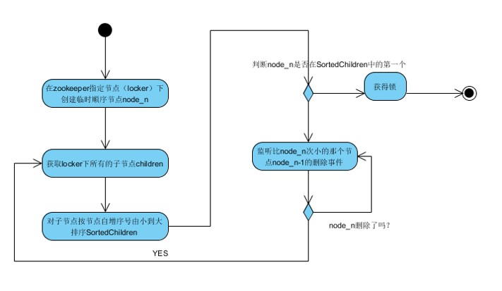  
<h4 id="1.6">1.6. zookeeper的分布式队列原理解析</h4>  
分布式队列架构图  
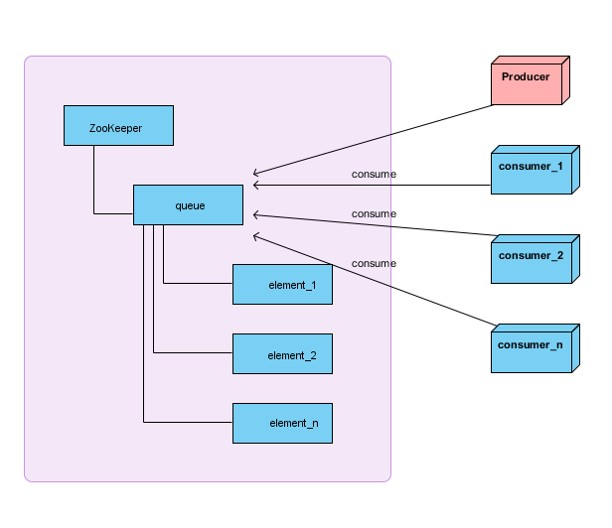  
分布式队列offer核心算法流程图  
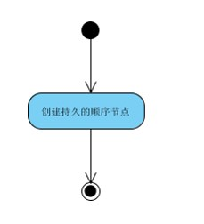  
分布式队列poll核心算法流程图  
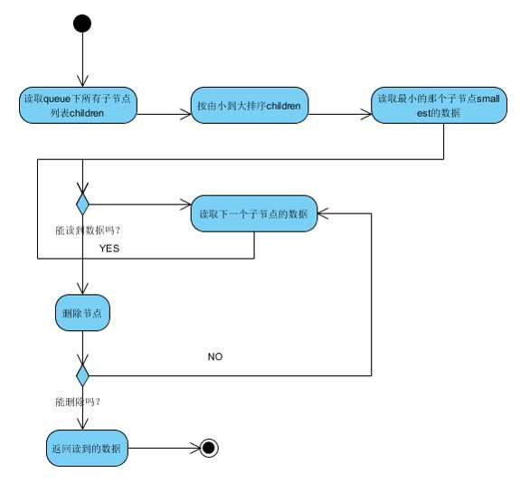  
<h4 id="1.7">1.7. zookeeper的命令服务原理解析</h4>  
命令服务架构图  
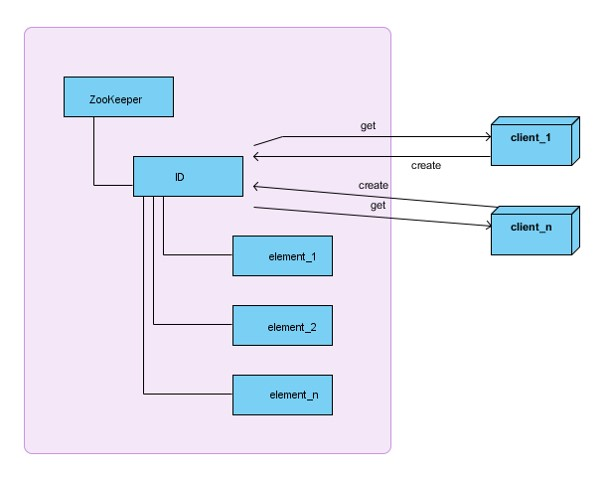  
命令服务核心算法流程图  
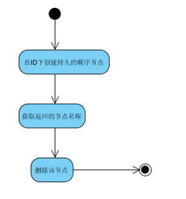  
  
  
  