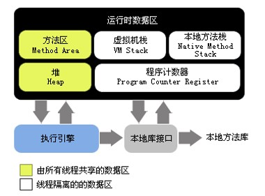

### JVM-java虚拟机  
1. 可以执行 Java 语言的高级语言虚拟机。 Java 语言虚拟机并不一定就可以称为 JVM，譬如：Apache Harmony  
2. 必须通过 Java TCK（Technology Compatibility Kit）的兼容性测试的Java语言虚拟机才能称为“Java™ 虚拟机；Java™ 虚拟机并非一定要执行“Java”程序  

### Java 虚拟机和内存区域概述  

Java 虚拟机运行时数据区：  

* 在《Java 虚拟机规范》中定义了若干种程序运行期间会使用到的存储不同类型数据的区域。  
* 有一些区域是全局共享的，随着虚拟机启动而创建，随着虚拟机退出而销毁。有一些区域是线程私有的，随着线程开始和结束而创建和销毁。  
* 是所有 Java 虚拟机共同的内存区域概念模型  
运行时数据区的划分：  
* 程序计数器、Java 堆、Java 虚拟机栈、本地方法栈、方法区  
  

**程序计数器（Program Counter Register）:**  

* 一块较小的的内存空间，它的作用可以看作是当前线程所执行的字节码的行号指示器。  
* 如果线程正在执行的是一个 Java 方法，这个计数器记录的是正在执行的虚拟机字节码指令的地址；如果正在执行的是 Native 方法，这个计数器值则为空。  
* 此内存区域是唯一一个在 Java 虚拟机规范中没有规定任何 OutOfMemoryError情况的区域。  

**Java 虚拟机栈:**  

* 线程私有  
* 后进先出（LIFO）栈  
* 存储栈帧，支撑 Java 方法的调用、执行和退出  
* 可能出现 OutOfMemoryError 异常和 StackOverflowError 异常  

**Java 本地方法栈**  

* 线程私有  
* 后进先出（LIFO）栈  
* 作用是支撑 Native 方法的调用、执行和退出  
* 可能出现 OutOfMemoryError 异常和 StackOverflowError 异常  
* 有一些虚拟机（如 HotSpot）将 Java 虚拟机栈和本地方法栈合并实现  

